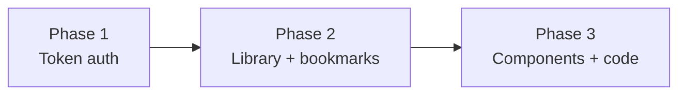
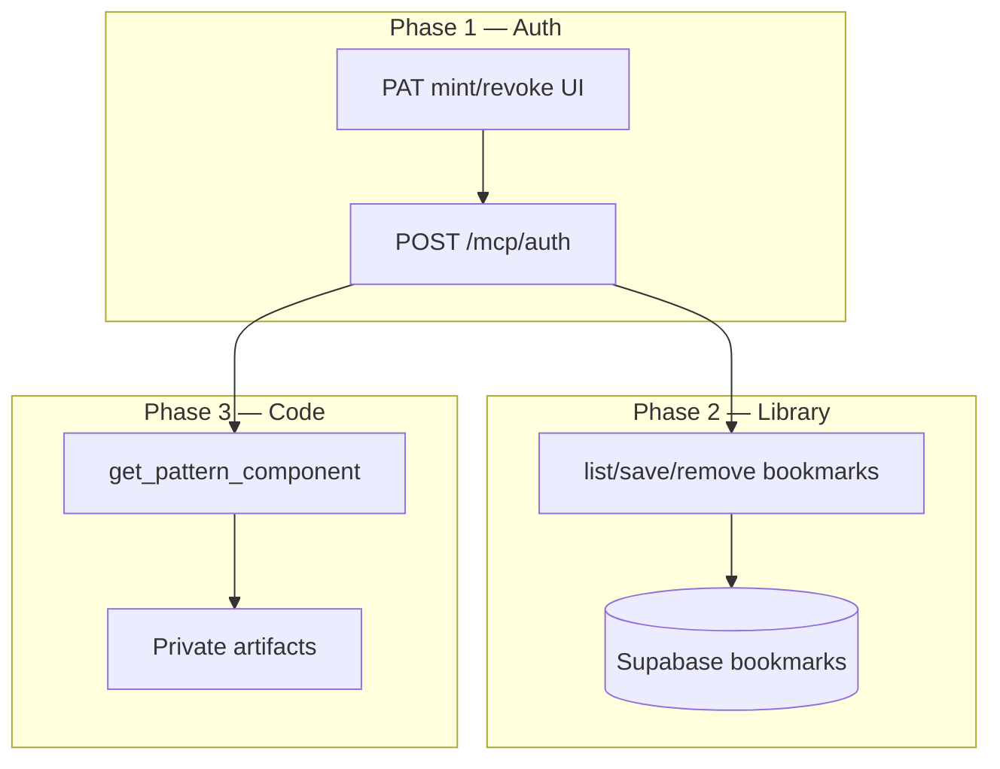

# Authenticated MCP Library — PRD & Implementation Estimate

Status: **Proposed** (not scheduled)  
Updated: July 2026  
Owner: Product / Platform

## Executive summary

Extend PATTTTERNS with an **authenticated MCP workspace** at `/mcp/auth` so users can connect AI agents (Cursor, Claude Desktop, custom automations) to their account via a **token authorization system**, then progressively unlock **library operations** and **component code access**.

Delivery is split into **three priority phases**. Each phase must be complete and shippable before the next begins.

| Priority | Phase | Main goal |
|---|---|---|
| **1** | Authorization | Token system working end-to-end |
| **2** | Library workspace | Pull library + save/remove patterns |
| **3** | Component export | Access generated code via MCP |

The **public MCP** at `/mcp` stays discovery-only forever (search, categories, `hasGeneratedComponent` boolean, no code).

**Do not implement from this file until Phase 1 is prioritized.**

---

## Problem

Today, agents can **find** patterns via public MCP but cannot:

- Authenticate as a specific PATTTTERNS user from an IDE
- Save patterns to a personal library
- List or manage bookmarks programmatically
- Read generated React/Tailwind code (login-gated in the UI)

Users who work in agents want PATTTTERNS as a **persistent, authorized workspace** — not a read-only catalog.

---

## Delivery phases (priority order)



---

## Phase 1 — Authorization token system (Priority 1)

**Main goal:** A user can mint a token, configure an MCP client, call `/mcp/auth`, and receive a verified authenticated session — with **no library or code tools yet** (only `initialize`, `ping`, `tools/list` reflecting enabled scopes).

### Scope

| In scope | Out of scope |
|---|---|
| `POST /mcp/auth` endpoint | Library read/write tools |
| Personal Access Token (PAT) mint/revoke | Component code retrieval |
| Scope model + enforcement middleware | Async export generation |
| Shared auth module (JWT + PAT) | Multi-library schema migration |
| Auth server card + catalog entry | Billing / `isPro` enforcement |
| Settings UI to manage tokens | |

### Token types

#### Primary: Personal Access Token (PAT)

The **main deliverable** for Phase 1. Users generate tokens in account settings and paste into MCP clients.

```
Authorization: Bearer pat_live_<random>
```

| Field | Purpose |
|---|---|
| `token_hash` | SHA-256 only — never store plaintext after mint |
| `user_id` | Owner (Supabase Auth UUID) |
| `name` | User label, e.g. "Cursor laptop" |
| `scopes` | Capability grants (see below) |
| `expires_at` | Optional expiry |
| `last_used_at` | Audit on each MCP call |
| `revoked_at` | Soft revoke |

**Mint flow:** user authenticated via Google OAuth → settings page → "Create MCP token" → show plaintext **once** → store hash.

#### Secondary: Supabase access JWT (interim / dogfooding)

Short-lived browser session token for internal testing before PAT UI ships:

```
Authorization: Bearer <supabase_access_token>
```

Reuse `verifySupabaseAccessToken()` from `netlify/functions/chatbot-policy.mts`. Useful for validating `/mcp/auth` plumbing; **not** the long-term agent UX.

#### Deferred: MCP OAuth metadata

`/.well-known/oauth-protected-resource` and dynamic client registration — only if PAT proves insufficient for compliant clients.

### Scope enum (Phase 1 defines; Phases 2–3 consume)

| Scope | Unlocks in phase | Tools gated |
|---|---|---|
| `mcp:connect` | **Phase 1** | `initialize`, `ping`, `tools/list` (meta only) |
| `library:read` | Phase 2 | `get_library`, `list_library_bookmarks` |
| `library:write` | Phase 2 | `save_pattern`, `remove_pattern`, `update_library` |
| `code:read` | Phase 3 | `get_pattern_component`, `list_pattern_variants`, `copy_component_bundle` |
| `export:enqueue` | Future | `generate_components_export`, `get_export_job_status` |

Phase 1 tokens may only include `mcp:connect`. Phase 2 mint defaults add `library:read` + `library:write`. Phase 3 adds `code:read` as opt-in.

### Phase 1 deliverables

| # | Deliverable | Size |
|---|---|---|
| 1.1 | `docs/queries/DB_MCP_PAT_TOKENS.sql` — PAT table + RLS | S |
| 1.2 | `netlify/lib/auth.mts` — extract JWT + PAT verify, Bearer parse, scope check | M |
| 1.3 | `netlify/lib/mcp-scopes.mts` — scope → capability map | S |
| 1.4 | `netlify/edge-functions/mcp-auth.ts` — `/mcp/auth` handler (`initialize`, `ping`, `tools/list`) | M |
| 1.5 | `netlify/functions/mcp-token-admin.mts` — create/list/revoke PAT (server-only) | M |
| 1.6 | `src/app/settings/mcp/page.tsx` + `src/lib/mcp-tokens.ts` — token management UI | M |
| 1.7 | `public/mcp/auth-server-card.json` + catalog entry + `mcp-library-workspace.md` skill (auth section only) | S |
| 1.8 | `scripts/validate-mcp-auth-tools.mjs` — contract tests for auth layer | S |
| 1.9 | Rate limits on `/mcp/auth` (body size, per-token budget) | S |

**Phase 1 total effort:** **L** (auth is cross-cutting: DB + edge + UI + discovery)

### Phase 1 acceptance criteria

- [ ] User can create a named PAT from settings; plaintext shown once
- [ ] User can list and revoke their tokens
- [ ] `POST /mcp/auth` with valid PAT returns successful `initialize`
- [ ] `POST /mcp/auth` with missing/invalid/revoked token returns `401`
- [ ] `POST /mcp/auth` with expired PAT returns `401`
- [ ] `tools/list` on Phase 1 only exposes connect/meta tools (no library/code tools)
- [ ] Token `last_used_at` updates on each authenticated request
- [ ] Public `/mcp` unchanged — no regression
- [ ] Auth server card published; catalog lists workspace MCP entry
- [ ] `scripts/validate-mcp-auth-tools.mjs` passes in CI

### Phase 1 data model

```sql
-- docs/queries/DB_MCP_PAT_TOKENS.sql (illustrative)
create table public.mcp_personal_access_tokens (
  id            uuid primary key default gen_random_uuid(),
  user_id       uuid references auth.users(id) on delete cascade not null,
  name          text not null,
  token_hash    text not null unique,
  scopes        text[] not null default '{mcp:connect}',
  expires_at    timestamptz,
  last_used_at  timestamptz,
  revoked_at    timestamptz,
  created_at    timestamptz default now()
);
```

RLS: users can `select`/`update` (revoke) own rows; inserts via `mcp-token-admin` function only.

---

## Phase 2 — Library workspace (Priority 2)

**Main goal:** An authenticated agent can **read the user's library** and **save or remove patterns** — the core bookmark workflow from the site, exposed as MCP tools.

Depends on **Phase 1 complete** (working PAT with `library:read` / `library:write` scopes).

### Scope

| In scope | Out of scope |
|---|---|
| `get_library` — title, description, share state | Component code bodies |
| `list_library_bookmarks` — saved patterns with metadata | Multi-library CRUD (optional stretch) |
| `save_pattern` — by slug or pattern id | `create_library` / `delete_library` (defer to multilibrary roadmap) |
| `remove_pattern` | Export generation |
| `update_library` — title, description | |
| Pattern resolution via `search-index.json` | |

Uses **today's schema** (`public.bookmarks` + `public.user_profiles`). Multi-library (`libraries` + `bookmark_on_library` from `ROADMAP_MULTILIBRARY.md`) is a **Phase 2 stretch** or fast-follow — not required for first ship.

### Phase 2 tools

| Tool | Scope | Description |
|---|---|---|
| `get_library` | `library:read` | Default library profile (title, description, share_enabled) |
| `list_library_bookmarks` | `library:read` | All saved patterns: title, slug, url, cover, tags, sort_order |
| `save_pattern` | `library:write` | Add pattern by `slug` or `pattern_id`; idempotent on duplicate |
| `remove_pattern` | `library:write` | Remove by `slug` or `pattern_id` |
| `update_library` | `library:write` | Update `library_title`, `library_description` |

### Phase 2 deliverables

| # | Deliverable | Size |
|---|---|---|
| 2.1 | `netlify/lib/supabase-service.mts` — server-side Supabase calls scoped to token user | M |
| 2.2 | Library tool handlers in `mcp-auth.ts` | M |
| 2.3 | Pattern slug/id resolver (reuse search-index fetch from public MCP) | S |
| 2.4 | Extend PAT default scopes to `library:read`, `library:write` on new tokens | S |
| 2.5 | Update auth server card + agent skill with library tool examples | S |
| 2.6 | Extend `validate-mcp-auth-tools.mjs` for library tools | S |

**Phase 2 total effort:** **M**

### Phase 2 acceptance criteria

- [ ] `list_library_bookmarks` returns only the authenticated user's bookmarks
- [ ] `save_pattern` with valid slug creates bookmark; duplicate call is idempotent
- [ ] `remove_pattern` deletes bookmark; missing bookmark returns clear error (not 500)
- [ ] `update_library` persists title/description to `user_profiles`
- [ ] Token without `library:write` cannot call `save_pattern` / `remove_pattern` (403)
- [ ] Token without `library:read` cannot call `list_library_bookmarks` (403)
- [ ] Agent skill documents full search → save workflow (public MCP search + auth MCP save)
- [ ] No code bodies in any Phase 2 response

### Phase 2 stretch (fast-follow)

When `ROADMAP_MULTILIBRARY` schema ships, add:

- `list_my_libraries`, `create_library`, `delete_library`, `move_pattern`
- `scripts/migrate-multilibrary.mjs` + `docs/queries/DB_MULTILIBRARY_MCP.sql`

---

## Phase 3 — Component & code access (Priority 3)

**Main goal:** An authenticated agent can **read generated component code** for patterns the user is entitled to access — matching what `PatternCodePanel` provides after login.

Depends on **Phase 1 + Phase 2 complete**.

### Scope

| In scope | Out of scope |
|---|---|
| `get_pattern_component` — TSX body | Inline generation in edge runtime |
| `list_pattern_variants` — available variants | Public anonymous code URLs via MCP |
| `copy_component_bundle` — structured paste payload (tsx + tokens css + meta) | Stripe billing enforcement (stub `isPro` only) |
| Private artifact storage migration | |

### Prerequisites (must complete before Phase 3 ships)

1. **Move artifacts off public URLs** per `ROADMAP_AI_ACCESS_AND_CACHE_SYNC.md` — code must not be world-fetchable if MCP exposes it to authenticated users only.
2. Phase 1 PAT with `code:read` scope opt-in at token mint.

### Phase 3 tools

| Tool | Scope | Description |
|---|---|---|
| `list_pattern_variants` | `code:read` | Variants for a pattern id (e.g. `react-tailwind`) |
| `get_pattern_component` | `code:read` | TSX source + optional `.tokens.css` |
| `copy_component_bundle` | `code:read` | Agent-friendly bundle: code, filename, pattern meta, citation url |

### Phase 3 deliverables

| # | Deliverable | Size |
|---|---|---|
| 3.1 | Private artifact storage path + auth-gated fetch layer | L |
| 3.2 | Code tool handlers in `mcp-auth.ts` | M |
| 3.3 | Entitlement stub (`isPro` check returns preview vs full — can start as auth-only) | S |
| 3.4 | `code:read` scope on PAT mint UI (checkbox, off by default) | S |
| 3.5 | Update server card + agent skill with code tool examples | S |
| 3.6 | Security review: confirm no public MCP leak of code bodies | S |

**Phase 3 total effort:** **L** (storage migration is the heavy lift)

### Phase 3 acceptance criteria

- [ ] `get_pattern_component` returns TSX only with valid PAT + `code:read` scope
- [ ] Request without `code:read` scope returns `403`
- [ ] Pattern without artifact returns structured `not_found` (not 500)
- [ ] Public `/mcp` still never returns code bodies
- [ ] `copy_component_bundle` includes citation URL and pattern title
- [ ] Code access correlates with existing `code_exported` analytics (optional event)

### Phase 3 future (not in initial Phase 3 ship)

Async generation via MCP (`generate_components_export`, job queue, worker) — track in `ROADMAP_EXPORT_CODE_MCP.md` as **Phase 4** when product prioritizes it.

---

## Architecture reference

### Two MCP surfaces

| Surface | URL | Auth | Phase |
|---|---|---|---|
| Discovery MCP | `POST /mcp` | None | Shipped (public) |
| Workspace MCP | `POST /mcp/auth` | Bearer PAT or JWT | Phase 1+ |



### Security model

| Control | Public `/mcp` | `/mcp/auth` |
|---|---|---|
| Rate limit | IP-based | IP + per-token bucket |
| Writes | Never | Phase 2+ with `library:write` |
| Code bodies | Never | Phase 3+ with `code:read` |
| Audit | Access logs | `last_used_at` per PAT |

**Principles:**

1. Public MCP stays read-only discovery forever.
2. PAT scopes default to minimum; `code:read` is opt-in.
3. Service role keys never ship to clients.
4. Generation (when added) is always async — never in edge cold path.

---

## Current state (built)

| Capability | Location | Relevant phase |
|---|---|---|
| Public MCP tools | `netlify/edge-functions/mcp.ts` | Pre-Phase 1 (done) |
| JWT verify | `netlify/functions/chatbot-policy.mts` | Phase 1 (reuse) |
| Bookmarks | `src/lib/bookmark-cloud.ts` → `public.bookmarks` | Phase 2 |
| Library profile | `src/lib/library-cloud.ts` → `public.user_profiles` | Phase 2 |
| Code panel (auth UI) | `src/components/PatternCodePanel.tsx` | Phase 3 reference |
| Component artifacts | `public/components/code/{id}.tsx` | Phase 3 (migrate to private) |

---

## Scripts & infrastructure by phase

### Phase 1

| Script / file | Purpose |
|---|---|
| `docs/queries/DB_MCP_PAT_TOKENS.sql` | PAT table + RLS |
| `netlify/lib/auth.mts` | JWT + PAT verification |
| `netlify/lib/mcp-scopes.mts` | Scope enforcement |
| `netlify/edge-functions/mcp-auth.ts` | Auth MCP handler |
| `netlify/functions/mcp-token-admin.mts` | Mint/revoke API |
| `scripts/validate-mcp-auth-tools.mjs` | Auth contract tests |
| `src/app/settings/mcp/page.tsx` | Token management UI |

### Phase 2

| Script / file | Purpose |
|---|---|
| `netlify/lib/supabase-service.mts` | User-scoped Supabase proxy |
| Extend `mcp-auth.ts` | Library tool handlers |
| Extend `validate-mcp-auth-tools.mjs` | Library tool tests |
| `scripts/build-agent-skills.mjs` | Update workspace skill |

### Phase 3

| Script / file | Purpose |
|---|---|
| Private storage migration | Per `ROADMAP_AI_ACCESS_AND_CACHE_SYNC` |
| Extend `mcp-auth.ts` | Code tool handlers |
| `scripts/build-artifacts-cache.mjs` | Artifact path references |

### Future (post Phase 3)

| Script / file | Purpose |
|---|---|
| `scripts/mcp-export-worker.mjs` | Async generation worker |
| `netlify/functions/mcp-export-job.mts` | Job enqueue + status |
| `scripts/migrate-multilibrary.mjs` | Multi-library backfill |

---

## Server discovery

### Phase 1 — add workspace catalog entry

```json
{
  "identifier": "urn:air:patttterns.com:patterns-workspace",
  "displayName": "PATTTTERNS Workspace MCP",
  "mediaType": "application/mcp-server-card+json",
  "url": "https://patttterns.com/mcp/auth/server-card"
}
```

Server card must document:

- `auth: bearer` (PAT required for agents; JWT for testing)
- Available scopes per phase
- Phase 2/3 tools listed only when shipped

---

## Success metrics

| Phase | Metric | Target |
|---|---|---|
| 1 | PAT mint → successful `initialize` | > 95% |
| 1 | Auth error rate (excl. user mistakes) | < 1% |
| 2 | Save pattern via agent | Works end-to-end in < 2 min from token setup |
| 2 | Bookmark isolation | Zero cross-user leakage |
| 3 | Code fetch success (entitled patterns) | > 99% |
| 3 | Public MCP code leak | Zero incidents |

---

## Risks & mitigations

| Risk | Phase | Mitigation |
|---|---|---|
| PAT theft | 1 | Revoke UX, optional expiry, minimal default scopes |
| Cross-user bookmark access | 2 | Server-side user_id from token only; never trust client |
| Public code URL leak | 3 | Block Phase 3 until private storage migration |
| Scope creep into billing | 3 | `isPro` stub only; no Stripe |

---

## Implementation prompts (per phase)

### Phase 1 prompt

```markdown
## Task: PATTTTERNS Authenticated MCP — Phase 1 (Token Auth)

### Goal
Working PAT system + `/mcp/auth` endpoint. No library or code tools.

### Context
- PRD: docs/product-roadmaps/specs/authenticated-mcp-library-prd.md
- Reuse JWT verify from netlify/functions/chatbot-policy.mts
- Public MCP at netlify/edge-functions/mcp.ts — do not modify behavior

### Deliverables
1. DB_MCP_PAT_TOKENS.sql + apply to Supabase
2. netlify/lib/auth.mts (JWT + PAT verify, scope check)
3. netlify/edge-functions/mcp-auth.ts at /mcp/auth
4. netlify/functions/mcp-token-admin.mts (mint/list/revoke)
5. src/app/settings/mcp/page.tsx (token UI)
6. public/mcp/auth-server-card.json + catalog entry
7. scripts/validate-mcp-auth-tools.mjs

### Done when
All Phase 1 acceptance criteria in the PRD pass.
```

### Phase 2 prompt

```markdown
## Task: PATTTTERNS Authenticated MCP — Phase 2 (Library)

### Goal
Library read/write tools on /mcp/auth. Requires Phase 1 complete.

### Deliverables
1. netlify/lib/supabase-service.mts
2. Tools: get_library, list_library_bookmarks, save_pattern,
   remove_pattern, update_library
3. PAT default scopes: library:read, library:write
4. Agent skill update with search→save workflow

### Done when
All Phase 2 acceptance criteria in the PRD pass. No code in responses.
```

### Phase 3 prompt

```markdown
## Task: PATTTTERNS Authenticated MCP — Phase 3 (Code)

### Goal
Authenticated code retrieval. Requires Phase 1+2 and private artifact migration.

### Deliverables
1. Private artifact fetch layer (not public /components/code URL)
2. Tools: list_pattern_variants, get_pattern_component, copy_component_bundle
3. code:read scope (opt-in at PAT mint)
4. Security review + no public MCP regression

### Done when
All Phase 3 acceptance criteria in the PRD pass.
```

---

## Related documents

- [Search & MCP Architecture](../../search-and-mcp/architecture.md)
- [ROADMAP MCP Unified Data Access](../roadmaps/ROADMAP_MCP_UNIFIED_DATA_ACCESS)
- [ROADMAP Multi-Library](../roadmaps/ROADMAP_MULTILIBRARY)
- [ROADMAP Export Code MCP](../roadmaps/ROADMAP_EXPORT_CODE_MCP)
- [ROADMAP Chat Auth](../roadmaps/ROADMAP_CHAT_AUTH)
- [ROADMAP AI Access & Cache Sync](../roadmaps/ROADMAP_AI_ACCESS_AND_CACHE_SYNC)
- [AUTH_SETUP](../../build-and-deploy/setup/AUTH_SETUP)
- [DB_SETUP](../../build-and-deploy/setup/DB_SETUP)

---

## Decision log

| Date | Decision | Rationale |
|---|---|---|
| 2026-07 | **3-phase priority:** auth → library → code | User-facing dependency order; token system is foundation |
| 2026-07 | Phase 1 primary deliverable is PAT, not JWT | IDE agents need long-lived pasteable tokens |
| 2026-07 | Separate `/mcp/auth` path | Clean rate limits, discovery, monitoring |
| 2026-07 | Public MCP never returns code | Soft-login product boundary |
| 2026-07 | Phase 3 blocked until private artifact storage | Prevent authenticated API + public URL double exposure |
| 2026-07 | Multi-library deferred to Phase 2 stretch | Single-library schema sufficient for first library MCP ship |
