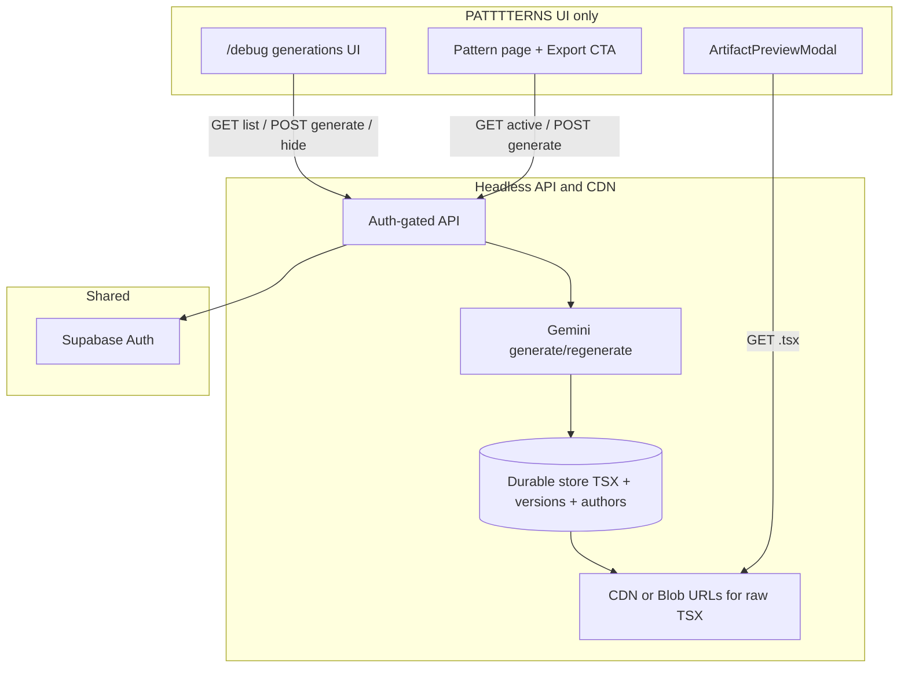

# PRD: Separated Components Generation & Preview (API/CDN)

**Status:** Phase 1–2 implemented on PATTTTERNS (same Netlify site). Phase 3–4 not started.  
**Canonical doc for the chat “Plan”** — do not maintain a second copy; update this file instead.

Prompting contract (1st gen vs regenerate, image/metadata gaps): [Components Generation Prompting](components-generation-prompting).

## Objective

Move component TSX out of the main PATTTTERNS `out/` build into a **headless API + CDN**. All user-facing UI stays on PATTTTERNS. Generations must not rebuild the main site.

## Locked split

| Layer | Lives where | Owns |
|-------|-------------|------|
| **All user-facing UI** | PATTTTERNS always | Pattern Export, previewer, `/debug`, login modal |
| **API + CDN** | Headless backend (Phase 1: Netlify Functions + Blobs on this site; later extractable to its own repo) | Durable TSX, versions, authors, Gemini generate/regenerate |

There is **no separate components website**.

## Goals

1. Signed users can generate new components.
2. Components may use primary or secondary pattern image; always exactly one immutable seed per pattern.
3. Versions under a pattern are grouped and stamped with author name/avatar.
4. PATTTTERNS does not rebuild on every generation.
5. Backend may be Functions+Blobs now, or a dedicated repo/CI later — same API contract.

## Problem

Today generated TSX starts as a **build artifact** of the main site:

- Written by `scripts/build-components-cache.mjs` into `public/components/code/`
- Committed in-repo, then copied into Netlify `out/` via Next static export (Phase 2 now **strips** `code/` + `history/` from publish)
- Preview/Export already HTTP-fetch by URL (`usePatternCode`) — that part was fine

Debug regenerate APIs that write the local filesystem **404 on Netlify** because `out/` is immutable.

So the blocker is not “preview can’t leave `out/`” — preview already loads by URL. The blocker is **mutable generation with durable storage**, while the main site remains a static CDN publish. Direction: component TSX leaves the main publish; UI stays on PATTTTERNS (no separate components website).

## Architecture



## Data model (per pattern)

```text
patternId
  seedVersionId: "seed"
  activeVersionId: "vN" | "seed"
  versions[]:
    versionId, kind: seed|regenerate
    createdAt, model, thinkingBudget
    imageRole: primary|secondary
    author: { id, name, email, image }
    hiddenAt?
```

- Seed is immutable and never soft-deleted.
- Regenerates use seed TSX as prompt context and a lower thinking budget.

## API contract

Base (Phase 1): `/.netlify/functions/components-api`

| Method | Query / body | Purpose |
|--------|----------------|---------|
| `GET` | `op=list` | All visible generations (for `/debug`) |
| `GET` | `op=versions&id=` | Versions for one pattern |
| `GET` | `op=active&id=` | Active TSX (text/plain) |
| `GET` | `op=code&id=&version=` | Specific version TSX |
| `POST` | `op=generate` + JSON `{ id, imageRole? }` | Seed or regenerate (auth required) |
| `POST` | `op=put-seed` + JSON `{ id, code, title?, slug?, coverImage? }` | Bootstrap immutable seed without Gemini (auth) |
| `POST` | `op=hide` + JSON `{ id, versionId, confirm, confirmAgain }` | Soft-hide non-seed (auth required) |

## Image gap

Search-index today has only `coverImage` (primary). Secondary image requires a later index/Notion enrichment. Phase 1 uses primary only.

## Phased delivery

### Phase 1 — Same-site Functions + Blobs ✅

- Auth-gated Netlify Function API
- Netlify Blobs for TSX + version indexes
- Bootstrap seed from existing `/components/code/{id}.tsx` on first generate if missing in Blobs
- Wire `/debug` regenerate/hide/list to the Function
- Main Export may still fall back to static TSX until Phase 2

### Phase 2 — Decouple main `out/` ✅ (this initiative)

Checklist:

- [x] `usePatternCode` uses Components API only in production; static/debug fallbacks remain for `next dev`
- [x] Postbuild strips `out/components/code` and `out/components/history` (`scripts/strip-components-from-out.mjs`)
- [x] Artifact badges use `components-status.json` (server + client), not published TSX
- [x] `op=put-seed` + migrate script bootstrap Blobs without Gemini
- [x] Optional `COMPONENTS_SEEDS_BASE_URL` for transitional seed fetch after strip
- [ ] Ops: run `node scripts/migrate-components-seeds-manifest.mjs --upload` against deployed API (or set seeds base URL) so Blobs have seeds before first Export after deploy

Repo keeps `public/components/code` for local generation cache and badge fallbacks; **publish dir does not**.

### Phase 3 — Secondary image + grouped UX

- Secondary image in index
- `/debug` grouped-by-pattern author filters

### Phase 4 — Optional extract

- Move Function/Blobs (or equivalent) into a dedicated components API repo/CDN host without changing PATTTTERNS UI

## Env (Phase 1–2)

| Var | Where | Purpose |
|-----|--------|---------|
| `GEMINI_API_KEY` | Netlify Function | Regenerate |
| `NEXT_PUBLIC_SUPABASE_URL` / anon | Function + UI | Auth |
| `NEXT_PUBLIC_COMPONENTS_API_BASE` | UI (optional) | Override API base; default `/.netlify/functions/components-api` |
| `COMPONENTS_SEEDS_BASE_URL` | Function (optional) | Transitional origin that still serves `/components/code/{id}.tsx` |
| `COMPONENTS_STRIP_OUT` | Build (optional) | Set `0` to skip stripping `out/` TSX |
| `PATTERN_REGENERATE_THINKING_BUDGET` | Function (optional) | Default `1024`; regenerate thinking tokens |
| `PATTERN_REGENERATE_GEMINI_TIMEOUT_MS` | Function (optional) | Default `22000`; Gemini abort for `op=generate` |
| `PATTERN_REGENERATE_TEMPERATURE` / `TOP_P` | Function (optional) | Mild sampling bump for click-only regenerates |

Prompt contract: [Components Generation Prompting](components-generation-prompting).  
Click-only regenerate quality (shipped): [Plan Status](click-only-regenerate-quality-plan).

## PRD prompt

> Build a **headless Components API/CDN**. PATTTTERNS remains the **only user-facing UI**. Signed Supabase users create an immutable seed and later regenerates (seed as context; primary/secondary image). Versions grouped by patternId with author attribution. Soft-hide never deletes seeds. PATTTTERNS must not ship TSX in `out/` long-term and must not rebuild on generate. Do not build a separate components website.

## Success metrics

- Regenerate works on Netlify without a main-site rebuild
- New versions persist in Blobs (not `out/`)
- Seeds remain available; authors recorded
- Export/Preview load active TSX from the Components API (no TSX in published `out/`)
