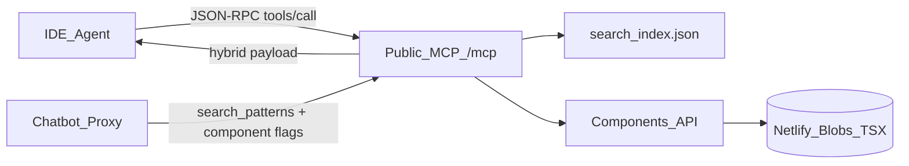

# PATTTTERNS MCP Server — Product Requirements Document

**Status:** In progress (v1 public TSX)  
**Updated:** August 2026  
**Owner:** Product / Platform  
**Surface:** Public hosted MCP at `POST https://patttterns.com/mcp` (Streamable HTTP)

---

## 1. Executive Summary & Business Goals

### Problem

AI coding agents (Cursor, Windsurf, Claude Desktop, and similar) routinely invent UI markup when asked for interaction patterns. PATTTTERNS already maintains a curated, versioned catalog of tested React/Tailwind TSX artifacts in the Components API (Netlify Blobs). Agents can **discover** patterns today via public MCP (`search_patterns`, `get_pattern`, `list_categories`) but historically received only metadata and a `hasGeneratedComponent` boolean — never the code itself. That gap forces agents to hallucinate layouts that diverge from our Swiss/Bauhaus, ASCII-grid aesthetic and from the project's design tokens.

### Goal

Allow AI coding agents to **natively consume PATTTTERNS TSX components** without hallucinating UI code.

### Primary focus

Extend the existing public MCP endpoint with a **lightweight, low-latency retrieval layer** that fetches exact, versioned catalog artifacts and returns them in an agent-ready hybrid payload — including **full pattern metadata and tags** so components stay grounded in the catalog. The server does not generate, compile, or rewrite code.

### Business outcomes

| Outcome | Why it matters |
|---|---|
| Fewer hallucinated UIs in IDE sessions | Agents paste catalog-faithful TSX instead of inventing components |
| Higher catalog utilization from agent workflows | MCP becomes a first-class distribution channel alongside the website |
| Better chatbot answers | Chatbot/Gemini know which patterns have components and can cite them |
| Contract-first retrieval before monetization | Public TSX now proves demand; an auth wall later can gate Pro inventory without redesigning tools |
| Zero-install agent UX | Clients already connect via `"url": "https://patttterns.com/mcp"` |

### Access phasing (explicit)

| Phase | Access | Intent |
|---|---|---|
| **v1 (this PRD)** | **Public** `get_component` returns TSX | Maximize adoption; validate payload + latency |
| **Later** | **Auth wall** via Supabase + Google SSO | Close or gate public code tools; migrate premium access to authenticated MCP |

### Future auth wall (documented now)

Site login today is **Supabase Auth with Google OAuth only** (no email/password or GitHub yet). That makes the later MCP auth wall straightforward:

1. **Human identity:** Google SSO through existing Supabase Auth (same as the website).
2. **Agent credential (pragmatic v1 of the wall):** User mints a Personal Access Token in account settings after Google login; MCP clients send `Authorization: Bearer pat_…`.
3. **Agent credential (spec-aligned upgrade):** MCP OAuth 2.1 / Protected Resource Metadata so Cursor/Claude can run a browser SSO connect flow against the same Supabase Google provider — no second identity system.

v1 ships **without** requiring tokens. Implement an entitlement hook (allow-all) so the wall is a policy flip, not a tool redesign. See also [Authenticated MCP Library PRD](authenticated-mcp-library-prd).

---

## 2. User Stories

### Primary

**The IDE Developer**  
As a developer using Cursor, I want to ask my agent to “get the sidebar component from pattern #123” so that I receive perfectly formatted TSX plus the pattern’s metadata and tags, matching PATTTTERNS interaction rules and declaring required CSS variables.

**Acceptance**

- Agent resolves catalog numbers (`#123`), UUIDs, or slugs to a pattern.
- `get_component` returns raw TSX, `usage_rules`, **tags**, and catalog metadata.
- Agent can open `resource` for a visual preview on patttterns.com.

**The Version Controller**  
As a user, I want to say “use component v1 from pattern #123” so my agent utilizes that exact layout.

**Acceptance**

- `get_component` accepts optional `version_id` (`seed`, `v1`, `v2`, …).
- Omitted `version_id` resolves to the catalog **active version** (= last generation / most polished).
- Explicit `version_id` returns that artifact or `version_not_found` — never a silent substitute.

### Supporting

**The Explorer** — Search by keyword, category, or tags to find `pattern_id`s that have components.  
**The Token-Aware Integrator** — Payload lists required `--ui-*` CSS variables.  
**The Chatbot Advisor** — Site chatbot knows which matched patterns have generated components and mentions that when relevant.  
**The Failure-Aware Agent** — Clear errors for missing pattern, missing component, or unknown version.

---

## 3. Core Functional Requirements

### A. The MCP Server (`patttterns-mcp`)

Hosted Streamable HTTP identity already advertised as `patttterns-mcp` on `POST /mcp`.

| Requirement | Detail |
|---|---|
| Transport | MCP Streamable HTTP, JSON-RPC 2.0 over `POST /mcp` (spec `2025-03-26`) |
| Runtime | [`netlify/edge-functions/mcp.ts`](../../../netlify/edge-functions/mcp.ts) |
| Existing tools | Keep `search_patterns`, `list_categories`, `get_pattern` (enrich with `pattern_id`, `tags`, `catalog_number` where useful) |
| New tools (v1) | `search_components`, `get_component` |
| Mutation tools | Out of scope — no generate / regenerate / hide / put-seed via MCP |

#### Tool: `search_components`

Find patterns that have fetchable component code, with **metadata and tags attached**.

| Arg | Type | Required | Notes |
|---|---|---|---|
| `query` | string | No* | Keyword search (normalize + token-AND); also matches tags |
| `category` | string | No* | Filter by pattern `type` or slug section / tag |
| `limit` | number | No | Default 10, hard max 50 |
| `only_with_code` | boolean | No | Default `true` |

\*At least one of `query` or `category` required.

**Each hit must include:** `pattern_id`, `catalog_number` (e.g. `#413`), `title`, `description`, `tags`, `type`, `slug`, `url`, `has_component`, `default_version` (`"active"` — last generation).

#### Tool: `get_component`

| Arg | Type | Required | Notes |
|---|---|---|---|
| `pattern_id` | string | **Yes** | Flexible ref: Notion UUID (dashed or normalized), catalog number (`#123` / `123`), or URL slug |
| `version_id` | string | No | `seed` / `v1` / `v2` / … Default = **active** (last gen, most polished) |

**Version priority rule:** When `version_id` is omitted, always serve Components API `op=active` (`activeVersionId`). That pointer is updated on each successful regenerate and is the product definition of “most polished / last generation.” Do not invent a separate “max vN” heuristic.

### B. The Hybrid JSON-RPC Payload

Canonical structured fields in the tool result:

| Part | Required | Contents |
|---|---|---|
| `metadata` | Yes | `name`, `pattern_id`, `catalog_number`, `version_id` (resolved), `category`/`type`, **`tags`**, interaction rules from catalog fields only |
| `usage_rules` | Yes | Required `--ui-*` CSS variables, design constraints, animation libraries when known |
| `component_code` | Yes | Exact raw TSX from Components API — **byte-faithful** |
| `resource` | Yes | Preview / pattern URL on patttterns.com |

#### Error shapes

`invalid_args` · `pattern_not_found` · `component_not_found` · `version_not_found` · `upstream_timeout` · `upstream_error`

---

## 4. Technical Architecture & Constraints

### Constraints

1. **Stateless retrieval** — no AI generation inside MCP.
2. **Strict adherence** — never alter TSX.
3. **Metadata coupling** — every component response carries pattern `tags` and catalog identity (`pattern_id`, `catalog_number`).
4. **Shared search semantics** — reuse normalize + token-AND from [Search & MCP Architecture](../../search-and-mcp/architecture); tag fields participate in `search_components`.
5. **Chatbot parity** — `chatbot-proxy` surfaces `hasGeneratedComponent` (and tags when available) into Gemini prompts and SSE pattern payloads.
6. **Auth-wall readiness** — entitlement hook on `get_component` is allow-all in v1; later Supabase/Google + PAT/OAuth.
7. **Observability (visibility, not anti-scraping)** — every MCP `initialize` / `tools/call` emits:
   - Structured Netlify edge log line `[mcp-usage] {…}` (includes raw IP for short-lived ops review)
   - Durable monthly counter blob `patttterns-mcp-usage` → `monthly/YYYY-MM.json` (hashed IP only, agent hint, tool, pattern, status, bytes)
   - Never log `component_code` / TSX bodies
   - No rate limiting in v1 (scraping defense deferred)

### Relationship to other initiatives

| Document | Relationship |
|---|---|
| [Components API CDN PRD](components-api-cdn-prd) | Source of truth for versioned TSX / `activeVersionId` |
| [Authenticated MCP Library PRD](authenticated-mcp-library-prd) | Future auth wall, library/bookmarks; Google via Supabase |

---

## 5. Future / Nice-to-Have (Not Priority for v1)

- **Auth wall + PATTTTERNS Pro** — Supabase Google SSO → PAT mint and/or MCP OAuth 2.1; gate premium components.
- **Stateful regeneration** — agents send modified TSX back for cloud variants (post-v1).
- Optional stdio/`npx` proxy for clients without Streamable HTTP.

---

## 6. Out of Scope

- Live AI generation or syntax repair loops  
- Replacing user global CSS (consumers map tokens onto `--ui-*`)  
- Library/bookmark mutations on public MCP  
- Email/GitHub login providers (not on the site yet)  
- Billing / Stripe in v1  

---

## 7. Success Metrics

| KPI | Definition | v1 target |
|---|---|---|
| MCP tool invocation volume | Weekly `search_components` + `get_component` | Establish baseline; grow week-over-week |
| Fetch latency | p95 successful `get_component` | **&lt; 500 ms** excl. cold-start outliers |
| Infra error rate | `upstream_error` / 5xx-class | **&lt; 2%** |
| Client error signal | `version_not_found` / `pattern_not_found` / `component_not_found` | Track separately |
| Payload fidelity | Hash match vs Components API body | **100%** on success |
| Chatbot component awareness | Share of chatbot pattern payloads including `hasGeneratedComponent` | **100%** after ship |

### Acceptance criteria (v1)

- [x] PRD documents public TSX + later Supabase/Google auth wall  
- [x] `search_components` / `get_component` on public `/mcp`  
- [x] Component payloads include pattern metadata + **tags**  
- [x] `#123` / UUID / slug resolution; default version = active (last gen)  
- [x] Chatbot proxy knows and cites component availability  
- [x] Server card + MCP page + agent skills updated  
- [x] Entitlement hook allow-all for future auth wall  
- [ ] Deploy smoke: live `get_component` against production Components API  

---

## Decision log

| Date | Decision | Rationale |
|---|---|---|
| 2026-08 | Host on public `/mcp`, not a local Node package | Zero-install URL config already works |
| 2026-08 | Ship public TSX in v1; auth wall later | Prove adoption before monetization |
| 2026-08 | Future auth = Supabase + Google SSO (+ PAT / MCP OAuth) | Matches current site login; no email/GitHub yet |
| 2026-08 | Default version = `activeVersionId` (last gen) | Most polished component pointer already maintained by Components API |
| 2026-08 | Tags + catalog metadata required on component tools | Components must stay related to pattern taxonomy |
| 2026-08 | Visibility logs + monthly Blobs counters (hashed IP, agent hint) | Confirm MCP traffic without rate-limiting yet; never log TSX |
