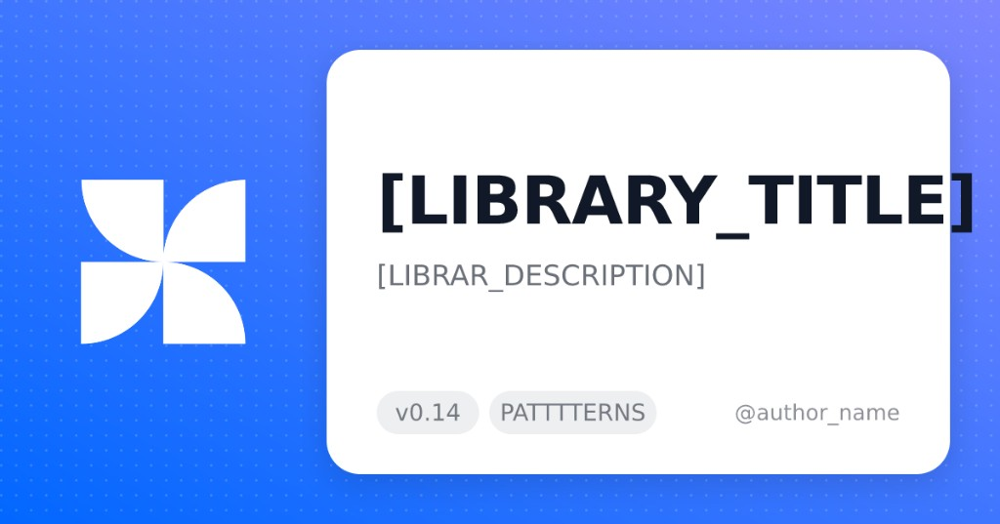
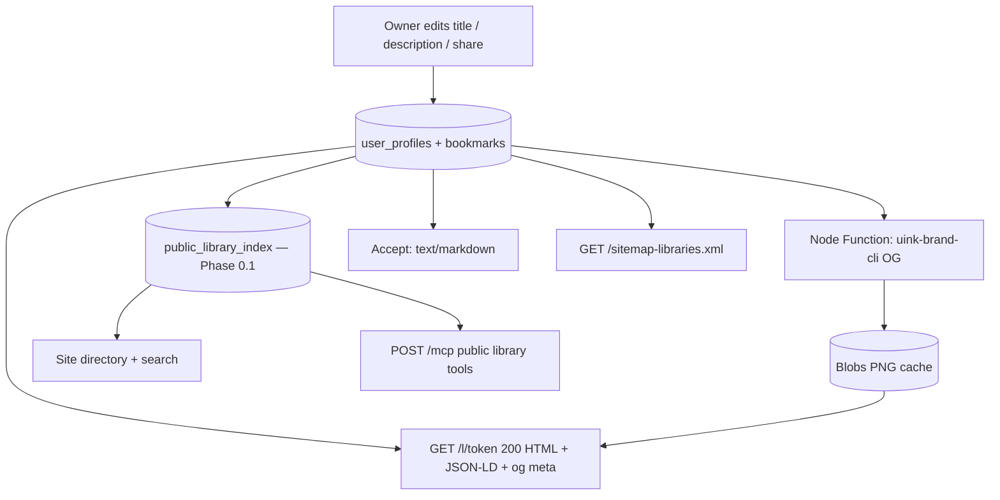
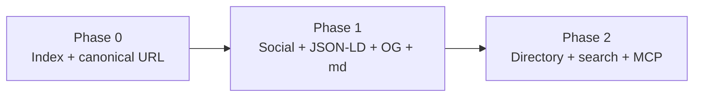

# Public Libraries — MCP, JSON-LD & Social Discovery PRD

**Status:** Phase 1 shipped (always-200 `/l/{token}` social / JSON-LD / OG / markdown + runtime sitemap). Phase 0 `public_library_index` table + Phase 2 listing still open.  
**Updated:** August 2026  
**Owner:** Product / Platform  
**Surfaces:** Canonical `/l/{token}`, owner `/library` (noindex SPA), site search, public MCP `POST /mcp`, social crawlers

---

## Executive summary

Owners already save a **library title** and **library context for AI** (description) on the public share view. Those fields stay on-page only. Shared libraries still use opaque query URLs (`/library?token=…`), a **generic** Open Graph card, no per-library JSON-LD, and they are **not** listed in site search, sitemap, or MCP.

This PRD makes every **share-enabled** library a first-class, citeable object:

1. Title + description populate **social metadata** and every **indexable store**.
2. Public libraries appear in the **site directory**, **site search**, and **public MCP**.
3. Agents receive a **canonical URL** plus **JSON-LD** and **markdown**.
4. Each library gets a **dynamic OG image** from [`uink-brand-cli`](https://github.com/pabliqe/uink-brand-cli) using the PATTTTERNS logo and primary brand colors.

**Do not implement Phase 2 from this file until it is prioritized.** Phase 1 is in production code (always-200 `/l/{token}` with title/description/OG/JSON-LD/markdown, `uink-brand-cli` OG, `/sitemap-libraries.xml`). Saving a library does **not** rebuild the static site. Adjacent work stays in [ROADMAP SHARED LIBS](../roadmaps/ROADMAP_SHARED_LIBS) (directory + username URLs) and [ROADMAP MULTILIBRARY](../roadmaps/ROADMAP_MULTILIBRARY) (schema + AI context). Authenticated owner MCP (`/mcp/auth`) stays in [Authenticated MCP Library PRD](authenticated-mcp-library-prd).

---

## Problem

| Today | Gap |
|---|---|
| Title / description saved on `user_profiles` | Not copied into `og:*`, Twitter, JSON-LD, sitemap, or search |
| Share URL `/library?token={uuid}` | Query-string identity; page is client-only + `force-static` |
| `src/app/library/layout.tsx` | Static title “Library Explorer \| PATTTTERNS”, image `/og-library.png` |
| `public/robots.txt` | `Disallow: /library` — crawlers must not index it |
| `public/search-index.json` | Patterns / flows / components only |
| Public MCP | Pattern + component tools only |
| JSON-LD | Site-wide `WebSite` + catalog `CollectionPage` in root layout |
| Markdown negotiation | Does not run on `/library` |

Social crawlers and agents read the **first HTML response**, not the client-side Supabase fetch. Unique on-page titles therefore never appear in Slack, LinkedIn, iMessage, or MCP citations.

---

## Goals

- Owner-authored **title** and **description** are the source of truth for social tags, JSON-LD, markdown, search, MCP, and OG text.
- Every public library has a **stable, unique, path-based URL** agents can share.
- Public libraries are **listed** on the site, in search, and via public MCP (read-only).
- Share cards use a **per-library OG PNG** (1200×630) generated with `uink-brand-cli`, PATTTTERNS isotype, and primary brand colors.
- Existing `/library?token=` links keep working.

## Non-goals

- Authenticated MCP write tools (`save_pattern`, owner `get_library`) — [Authenticated MCP Library PRD](authenticated-mcp-library-prd).
- Multi-library schema (`libraries` + `bookmark_on_library`) — [ROADMAP MULTILIBRARY](../roadmaps/ROADMAP_MULTILIBRARY) Phase 2. This feature ships on **current** `user_profiles` + `bookmarks`.
- Username / slug SEO (`/library/[username]/[slug]`) as a **blocker**. Tracked as a later alias.
- Forcing title/description before share is enabled (fallbacks exist; empty copy is still indexed).
- View counters, pricing, or “fork this library”.

---

## Current data (already shipped)

```ts
type LibraryProfile = {
  user_id: string;
  library_title: string | null;        // ≤ 60 chars, owner-editable
  library_description: string | null;  // ≤ 500 chars, “LIBRARY CONTEXT FOR AI”
  share_token: string | null;          // UUID
  share_enabled: boolean;
  public_display_name: string | null;
  public_avatar_url: string | null;
  public_show_author: boolean;
};
```

Public read today: `getPublicProfile(token)` + `getPublicBookmarks(user_id)` via Supabase REST + RLS (`share_enabled = true`).

---

## URL strategy vs social profiling

Documented constraint ([ROADMAP MULTILIBRARY](../roadmaps/ROADMAP_MULTILIBRARY) non-goal, [ROADMAP SHARED LIBS](../roadmaps/ROADMAP_SHARED_LIBS) Feature 4): libraries **do not** have unique SEO paths. Live share links look like:

```
https://patttterns.com/library?token=b0160c5b-179c-418c-8380-10cd3d8b09c6
```

### Does this block social / MCP / JSON-LD?

**Query-string-only identity blocks crawler-correct social cards and agent citation.** It does **not** require username slugs.

| Concern | Query `?token=` only | Path `/l/{token}` | Username `/library/{handle}` |
|---|---|---|---|
| Unique `@id` / `og:url` | Weak (one static `/library` HTML) | Yes | Yes |
| `generateMetadata` / edge rewrite | No — layout is static | Yes | Yes |
| Sitemap + robots allow | Awkward; currently disallowed | Yes | Yes |
| MCP resource URI | Fragile | Yes | Yes |
| Needs username uniqueness | No | No | Yes (not built) |
| Needs multi-library slugs | No | No | Later |

**Decision for this PRD:** introduce a **canonical path** now; keep the token as the identifier; defer pretty usernames.

| Role | URL |
|---|---|
| Canonical (Google, agents, OG, JSON-LD, sitemap, MCP) | `https://patttterns.com/l/{share_token}` |
| Interactive SPA (noindex; not canonical) | `https://patttterns.com/library?token={share_token}` |
| Owner workspace | `/library` (authenticated, `noindex`, static CDN) |
| Public directory | `/library` for anonymous visitors (see Phase 2) or `/libraries` if owner UX must keep `/library` |
| Future alias (out of scope) | `/library/{username}` → same resource via `sameAs` / 308 |

`/l/` is used so `/library/[username]` can still land later without colliding with tokens.

Share button and clipboard copy the canonical URL. Regenerating `share_token` changes the canonical URL (same as today). Do **not** 308 `/library?token=` → `/l/{token}`: that would either loop with the interactive CTA or send Google onto a `Disallow`/`noindex` SPA.

---

## Metadata contract

One mapping. No separate “SEO title” field.

| Source | Fallback | Written to |
|---|---|---|
| `library_title` | `"My Pattern Library"` | `title`, `og:title`, `twitter:title`, JSON-LD `name`, search `title`, MCP `title`, OG heading |
| `library_description` | `"A curated pattern library on PATTTTERNS."` | `meta description`, `og:description`, `twitter:description`, JSON-LD `description`, search `description`, MCP `description`, OG subtext |
| Canonical URL | `/l/{token}` | `og:url`, `canonical`, JSON-LD `@id` / `url`, MCP `url`, markdown permalink |
| Author (if `public_show_author`) | omit | JSON-LD `author`, search snippet, OG footer handle |
| Pattern count | `0` | JSON-LD `numberOfItems`, search / MCP / cards |
| OG image | generated PNG, else `/og-library.png` | `og:image`, `twitter:image` |

**Indexable database** (required, not only HTML):

```sql
-- Illustrative. May be a view over user_profiles + bookmark counts.
create table public.public_library_index (
  share_token          uuid primary key,
  user_id              uuid not null,
  title                text not null,
  description          text not null,
  canonical_url        text not null,
  author_name          text,
  show_author          boolean not null,
  pattern_count        int not null default 0,
  og_image_url         text not null,
  share_enabled        boolean not null,
  updated_at           timestamptz not null,
  indexed_at           timestamptz not null default now()
);
```

Rules:

- Row exists **only** while `share_enabled = true` and `share_token` is set.
- Title/description stored **after fallbacks** so indexes never ship nulls.
- Refresh on title/description/share/bookmark changes (trigger, or the existing client writes plus a reconcile cron).
- RLS: `anon`/`authenticated` SELECT of this table (or a SECURITY DEFINER function) for public listing; no writes from anon.
- Site search, MCP, and `llms.txt` **must** read this index (or a JSON snapshot built from it) once it exists. Until then, `/sitemap-libraries.xml` and `/l/{token}` read `user_profiles` via RLS — do not scrape HTML.

Optional snapshot for static/edge: `public/libraries-index.json` generated on a schedule (same idea as `search-index.json`, but **runtime** data — not Notion build).

---

## JSON-LD and markdown for agents

### JSON-LD (on the canonical HTML)

Inject `application/ld+json` on `/l/{token}` only (not the owner `/library` workspace). Shape extends [ROADMAP MULTILIBRARY](../roadmaps/ROADMAP_MULTILIBRARY) §3b:

```json
{
  "@context": "https://schema.org",
  "@type": ["Collection", "ItemList"],
  "@id": "https://patttterns.com/l/{token}",
  "url": "https://patttterns.com/l/{token}",
  "name": "<library title>",
  "description": "<library description>",
  "isPartOf": { "@id": "https://patttterns.com#website" },
  "author": { "@type": "Person", "name": "<owner display name>" },
  "numberOfItems": 10,
  "image": "https://patttterns.com/og/library/{token}.png",
  "itemListElement": [
    {
      "@type": "ListItem",
      "position": 1,
      "name": "<pattern title>",
      "url": "https://patttterns.com/patterns/<slug>"
    }
  ]
}
```

Omit `author` when `public_show_author` is false. Cap `itemListElement` (e.g. 50) with `numberOfItems` still equal to the real count.

### Markdown

Agents already request `Accept: text/markdown` ([`markdown-negotiation`](../../../netlify/edge-functions/markdown-negotiation.ts) on pattern routes). Public libraries handle markdown in [`public-library`](../../../netlify/edge-functions/public-library.ts) on `/l/{token}` only — not on `/library`. Prefer a **structured** library markdown document over stripped HTML:

```markdown
# {title}

{description}

- URL: https://patttterns.com/l/{token}
- Author: {name}   <!-- omit if hidden -->
- Patterns: {n}

## Patterns

1. [{title}](https://patttterns.com/patterns/{slug})
```

MCP `get_public_library` returns this markdown in `content[]` **and** a JSON blob (same fields). HTML pages keep JSON-LD for crawlers that do not send `Accept: text/markdown`.

---

## Open Graph image

Replace the generic blue-folder card (`public/og-library.png`) on **per-library** URLs. Directory `/library` may keep the generic card.

### Visual contract



| Region | Content |
|---|---|
| Background | Primary theme: blue → violet gradient + dot grid (`ogOptions.theme = "primary"`, dots on) |
| Left | PATTTTERNS isotype (`public/patttterns-iso.svg` / `brand.assets.logo`) |
| Heading | Library title |
| Subtext | Library description (truncated to fit) |
| Footer pills | Site version (`package.json` / brand version) + `PATTTTERNS` |
| Footer right | `@author` when shown, otherwise omit |

Colors from repo `brand.json`: `--theme-primary` `#0267FF`, `--theme-tertiary` `#5C23ED`, `--theme-primary-light` `#00D1FF`.

### Generator

Use the **programmatic** CLI core already depended on as `uink-brand-cli` (`file:../uink-brand-cli`):

```js
import { parseBrandFromJson } from "uink-brand-cli/lib/parser.js";
import { generateAssetsInMemory } from "uink-brand-cli/lib/generator.js";

const brandData = parseBrandFromJson(brandJson);
brandData.siteTitle = libraryTitle;
brandData.description = libraryDescription;
brandData.name = "PATTTTERNS";
// Footer-right is currently formatSiteUrlForDisplay(siteUrl).
// Pass author handle here, or extend CLI with ogOptions.footerLabel.

const { files } = await generateAssetsInMemory(brandData, {
  force: true,
  sourceLogo: patttternsIsoSvg,
  ogOptions: { theme: "primary", showDots: true },
});
```

Do **not** hand-draw a parallel Satori template. If footer-right cannot show `@author` without abusing `siteUrl`, add a small `ogOptions.footerLabel` in `uink-brand-cli` and bump the local file dependency.

### Serving and cache

`@resvg/resvg-js` is **Node-native** — not Deno edge. Generate in a **Netlify Function** (or Node cron), not the MCP edge handler.

| Item | Value |
|---|---|
| Public URL | `https://patttterns.com/og/library/{share_token}.png` |
| Size | 1200×630 PNG |
| Cache key | hash(`title`, `description`, `author`, `show_author`, brand version, logo, theme) |
| Store | Netlify Blobs (or equivalent) + long `Cache-Control` |
| Invalidate | On title/description/author/share save |
| Fallback | `/og-library.png` if generation fails |
| Crawler | `og:image` must be absolute, `og:image:width` 1200, `og:image:height` 630, `type` `image/png` |

Because the app is **static export**, per-library `<meta>` cannot come from `library/layout.tsx`. Serve a **single always-200 HTML document** at `/l/{token}` for every user-agent (Google, social crawlers, agents, humans). Do **not** split by UA or 308 browsers onto `/library` (cloaking risk + `robots.txt` `Disallow: /library`).

Human masonry stays the existing client `LibraryFlowView` at `/library?token=` (noindex). The `/l/{token}` page links to it.

Saving title/description/share does **not** rebuild Netlify `/out` (same cost model as not regenerating TSX on every library change). Tokens are unknown at `generateStaticParams` time.

**Cost (BETA, low traffic is fine):**

| Path | Runtime | When it runs |
|---|---|---|
| `/library` | Static CDN only (redirector excluded) | Owner / SPA views |
| `/l/{token}` | Node Function + Supabase; Netlify CDN `s-maxage=300` | Share + crawler + agent hits |
| `/og/library/{token}.png` | Node Function + Blobs; long CDN cache | First unfurl per cache key |
| `/sitemap-libraries.xml` | Node Function; CDN `s-maxage=600` | Google/agent sitemap fetches |

---

## Listing: site, search, MCP

Only `share_enabled` libraries.

### Site

- Public directory of library cards: title, description, author, pattern count, OG/cover.
- Reuses [ROADMAP SHARED LIBS](../roadmaps/ROADMAP_SHARED_LIBS) Features 2–3 (`PublicLibraryCard`, `OwnerAvatar`).
- Anonymous `/library` should not be a login wall (shared-libs principle). Owner workspace stays available after sign-in.

### Site search

Extend `SearchResult.type` with `"library"` (or a dedicated libraries fetch merged in the search UI). Fields: `title`, `description`, `slug` = canonical path `/l/{token}`, `searchText` = title + description + author. Same `normalizeQuery` as patterns ([Search & MCP Architecture](../../search-and-mcp/architecture)).

### Public MCP (`POST /mcp`)

Read-only discovery. **Names avoid colliding** with future `/mcp/auth` `get_library`:

| Tool | Args | Returns |
|---|---|---|
| `search_public_libraries` | `query`, `limit` (default 10, max 50) | Hits from `public_library_index` |
| `get_public_library` | `token` **or** `url` | Profile + bookmarks + `url` + markdown/JSON-LD summary |
| `list_public_libraries` | `limit`, optional `sort` (`updated` \| `count`) | Directory page |

Each hit includes: `title`, `description`, `url` (canonical), `token`, `pattern_count`, `author` (or null), `og_image`. Bookmark rows include pattern `title`, `url`, `slug`, `tags` — **no component TSX**.

Update `public/mcp/server-card`, `llms.txt`, and add an agent skill `browse-public-libraries.md`.

---

## Architecture



**Privacy:** listing a library is opt-in (`share_enabled`). Token in the path is still a capability URL — do not put private libraries in the index. Regenerating the token drops the old row and OG cache.

**Static export:** public library HTML/meta is a **runtime** surface. Do not wait for Notion `prebuild`. Until `public_library_index` exists, `/l/{token}` and `/sitemap-libraries.xml` read `user_profiles` via existing RLS (`user_profiles_public_select_shared`).

---

## Phased delivery



### Phase 0 — Canonical URL + index table

**Goal:** every public library has a stable `/l/{token}` and a row in `public_library_index`.

| # | Deliverable |
|---|---|
| 0.1 | SQL for `public_library_index` (or view) + RLS + backfill from `user_profiles` |
| 0.2 | Route `/l/[token]` (profile + bookmarks; 404 if disabled/unknown) — **done** (Node Function; always 200 SEO HTML for every UA) |
| 0.3 | Do **not** 308 `/library?token=` → `/l/{token}` — **done** (SPA stays interactive + noindex; share copies `/l/`) |
| 0.4 | Share clipboard copies canonical URL — **done** |
| 0.5 | `robots.txt`: allow `/l/`; keep owner workspace `noindex` — **done** |
| 0.6 | Sitemap entries from live public profiles (`/sitemap-libraries.xml`) — **done**; `public_library_index` still later |

**Exit:** opening a shared `/l/{token}` returns 200 with title/description. Disabled shares 404. Legacy `?token=` still opens the SPA.

### Phase 1 — Social, JSON-LD, OG, markdown

**Goal:** crawlers and agents see owner title/description and a branded card.

| # | Deliverable |
|---|---|
| 1.1 | Server-injected `title`, `description`, `canonical`, `og:*`, `twitter:*` from live public profile — **done** |
| 1.2 | Collection/ItemList JSON-LD — **done** |
| 1.3 | Markdown negotiation (`Accept: text/markdown` on `/l/{token}`) — **done** |
| 1.4 | OG Function via `generateAssetsInMemory` + PATTTTERNS logo + primary theme — **done** (`/og/library/{token}.png`) |
| 1.5 | `og:image` absolute URL; fallback `/og-library.png` — **done** |

**Exit:** Facebook/LinkedIn/Slack debugger (or `curl` HTML) for `/l/{token}` shows custom title, description, and 1200×630 PNG — not “Library Explorer”. Coywolf-style checks: `og:title`, `og:description`, `og:image`, `og:url` present.

### Phase 1 implementation notes

Shipped on static export via Netlify (no Next dynamic route):

| File | Role |
|---|---|
| `src/lib/public-library-shared.mjs` | Title/description mapping, URLs, JSON-LD, markdown |
| `netlify/functions/public-library.mts` | Always-200 `/l/{token}` HTML (title/desc/canonical/og/JSON-LD) + markdown |
| `netlify/functions/library-og.mts` | `GET /og/library/{token}.png` via `uink-brand-cli` + Blobs cache |
| `netlify/functions/sitemap-libraries.mts` | `GET /sitemap-libraries.xml` from `user_profiles` |
| `src/components/LibraryShareButton.tsx` | Copies `/l/{token}` |
| `public/robots.txt` | `Allow: /l/`; `Sitemap: /sitemap-libraries.xml`; still `Disallow: /library` |

Every UA gets the same `/l/{token}` document (`index,follow`). `/library` is a static CDN SPA (`noindex`). No Edge on `/library`.

### Phase 2 — Directory, search, public MCP

**Goal:** libraries are discoverable without knowing the token.

| # | Deliverable |
|---|---|
| 2.1 | Public directory cards ([SHARED LIBS](../roadmaps/ROADMAP_SHARED_LIBS) Features 2–3) |
| 2.2 | Site search includes `type: "library"` |
| 2.3 | MCP tools `search_public_libraries`, `get_public_library`, `list_public_libraries` |
| 2.4 | Server card, `llms.txt`, agent skill |
| 2.5 | Optional `libraries-index.json` snapshot for edge |

**Exit:** a query like “onboarding libraries” returns public libraries in the topbar and via MCP, each with a canonical URL.

### Later (not this PRD)

- `/library/{username}` aliases — SHARED LIBS Feature 4.
- Multi-library rows — MULTILIBRARY Phase 2; index gains `library_id` + slug.
- Gemini auto-fill description — MULTILIBRARY Phase 3c.
- View counters — SHARED LIBS Feature 1.

---

## Acceptance criteria

- [x] Public library HTML `title` / `og:title` equal owner `library_title` (or fallback), never the generic Explorer title.
- [x] `og:description` equals owner `library_description` (or fallback).
- [x] `og:url` and `<link rel="canonical">` are `https://patttterns.com/l/{token}`.
- [x] `og:image` is a 1200×630 PNG from `uink-brand-cli` with PATTTTERNS logo and primary gradient; matches the template attached to this spec.
- [x] JSON-LD validates as Collection/ItemList with name, description, url, and pattern items.
- [x] `Accept: text/markdown` (or MCP text) returns title, description, canonical URL, and pattern links.
- [ ] `public_library_index` (or equivalent) stores title, description, canonical URL, counts, OG URL for every `share_enabled` library.
- [x] `/library?token=` remains the interactive SPA (`noindex`); share copies `/l/{token}`.
- [x] `robots.txt` allows `/l/`; owner `/library` remains `noindex`.
- [x] Sitemap lists canonical public library URLs (`/sitemap-libraries.xml`).
- [ ] Site directory and site search list public libraries.
- [ ] Public MCP can search, list, and fetch a library **without** auth and **without** TSX bodies.
- [x] Private (`share_enabled = false`) libraries never appear in OG routes (404) or canonical HTML.
- [ ] Regenerating the share token removes the old URL from index/sitemap and issues a new canonical.

---

## Risks

| Risk | Mitigation |
|---|---|
| Static export has one HTML for `/library` | Always-200 runtime `/l/{token}` Edge HTML; SPA stays noindex |
| UA-split 308 to `/library` | Rejected — Google would index a Disallow URL / cloaking |
| Token-in-path still guessable if listed | Listing is the point of public share; private stays off-index |
| Token rotation breaks citations | Same as today’s share links; document in UI |
| `uink-brand-cli` footer is `siteUrl` | Pass handle as footer label or extend CLI |
| Native `@resvg` on Edge | Node Function only |
| MCP tool name clash with `/mcp/auth` | `*_public_library*` names |
| Index lag vs live bookmarks | Reconcile on write + periodic cron |
| Username SEO delayed | Canonical `/l/{token}` is enough for this PRD |

---

## Success metrics

| Metric | Target |
|---|---|
| Public library shares with custom `og:title` in crawler HTML | 100% of `share_enabled` |
| MCP `get_public_library` includes canonical `url` | 100% |
| Index/sitemap/MCP omit private libraries | Zero leaks |
| OG generation success (cached or fresh) | > 99% |

---

## Related documents

- [ROADMAP Shared Libraries](../roadmaps/ROADMAP_SHARED_LIBS) — directory, cards, username URLs, OG (this PRD is the execution spec for OG + indexing + MCP/JSON-LD)
- [ROADMAP Multi-Library](../roadmaps/ROADMAP_MULTILIBRARY) — title/description fields, JSON-LD sketch §3b, token URLs, SEO slugs deferred
- [Authenticated MCP Library PRD](authenticated-mcp-library-prd) — owner workspace MCP, not public discovery
- [PATTTTERNS MCP Server PRD](patttterns-mcp-server-prd) — public `/mcp` patterns + components
- [Search & MCP Architecture](../../search-and-mcp/architecture)
- [Sitemap setup](../../build-and-deploy/setup/SITEMAP_SETUP)
- [DB setup](../../build-and-deploy/setup/DB_SETUP)

---

## Decision log

| Date | Decision | Rationale |
|---|---|---|
| 2026-08 | Canonical `/l/{share_token}` now; username slugs later | Unlocks OG/JSON-LD/MCP without waiting on handles or multi-library |
| 2026-08 | Keep `?token=` as the noindex SPA (not a 308) | Existing interactive masonry; Google must not follow a redirect onto `Disallow: /library` |
| 2026-08 | `/l/{token}` as Node Function (not Edge) | Netlify CLI on macOS `spawn EBADF` with 4+ Edge Deno config loads; Functions already used for OG/sitemap |
| 2026-08 | No Edge on `/library` | Owner workspace is static CDN; Functions only on share/crawler paths |
| 2026-08 | Title/description are the only copy fields | Already the AI-context UX on `/library` |
| 2026-08 | OG via `uink-brand-cli` `generateAssetsInMemory`, primary theme + isotype | Same generator as site brand; matches attached template |
| 2026-08 | Public MCP tools named `*_public_library*` | Avoid clash with authenticated `get_library` |
| 2026-08 | `public_library_index` required for search/MCP | Social HTML is not an index; sitemap currently reads `user_profiles` RLS until the table exists |
